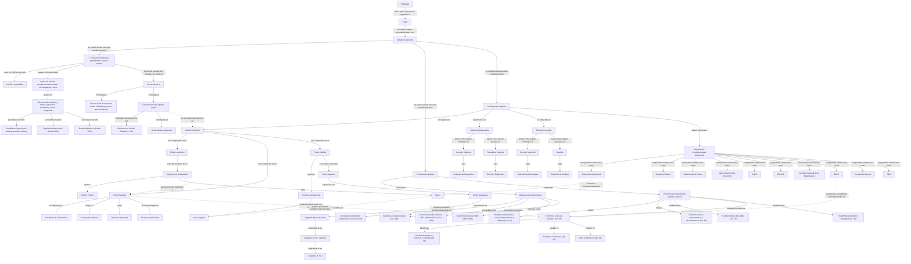

```mermaid
graph TD
    %% Base Conceptual
    A["El Estado"] -->|es la forma superior de organizar el| B["Poder"]
    B -->|sometido a reglas preestablecidas es un| C["Estado de Derecho"]
    
    C -->|se estudia desde tres ejes complementarios| EJE1["1. Evolución histórica y problemática hechos-normas"]
    C -->|se estudia desde tres ejes complementarios| EJE2["2. Dimensión política"]
    C -->|se estudia desde tres ejes complementarios| EJE3["3. Dimensión orgánica"]

    %% 1. Evolución histórica
    EJE1 -->|nace en 1821 sin ser aún| H1["Nación consolidada"]
    EJE1 -->|arrastra un límite central| H2["Copia del modelo europeo/norteamericano sin adaptación crítica"]
    H2 -->|generó un| H3["Divorcio entre hechos y normas (derechos declarados, nunca cumplidos)"]
    
    H3 -->|se mantuvo durante| H4["Caudillismo (hasta antes de la guerra del Pacífico)"]
    H3 -->|se mantuvo durante| H5["República Aristocrática (hasta 1930)"]
    H3 -->|se mantuvo durante| H6["Estado oligárquico (hasta 1970)"]
    
    EJE1 -->|el periodo republicano muestra, sin embargo| H7["Dos tendencias"]
    H7 -->|1ª tendencia| H8["Construcción de la nación desde el Estado (proceso aún inconcluso)"]
    H7 -->|2ª tendencia| H9["Consolidación del aparato estatal"]
    H9 -->|impulsada decisivamente por| H10["Reformas de Ramón Castilla (s. XIX)"]
    H9 -->|continuada por| H11["Gobernantes posteriores"]

    %% 2. Dimensión política
    EJE2 -->|comprende| P1["Derechos constitucionales"]
    P1 -->|tienen origen en| P2["Declaraciones liberales (Pensilvania, Francia 1789)"]
    P1 -->|se ampliaron con| P3["Derechos sociales (México 1917, Weimar 1919, Perú 1933)"]
    P1 -->|culminan en los| P4["Derechos humanos (ONU 1948, OEA)"]
    P1 -->|se protegen mediante| P5["Garantías constitucionales (art. 200)"]

    EJE2 -->|comprende| P6["Principios de organización y política general"]
    P6 -->|incluye| P7["República democrática, social, independiente y soberana (art. 43)"]
    P6 -->|incluye| P8["Gobierno unitario, representativo y descentralizado (art. 43)"]
    P6 -->|establece que| P9["El poder emana del pueblo (art. 45)"]
    P6 -->|dictamina que| P10["Se prohíbe el gobierno usurpador (art. 46)"]
    P6 -->|instituye el modelo de| P11["Economía social de mercado (art. 58)"]
    
    P11 -->|basado en| P12["Libertad de empresa, comercio e industria (art. 59)"]
    P11 -->|basado en| P13["Pluralismo económico (art. 60)"]
    P11 -->|basado en| P14["Libre competencia (art. 61)"]

    %% 3. Dimensión orgánica - Ramas Principales
    EJE3 -->|se organiza en| O1["Gobierno Central"]
    EJE3 -->|se estructura en| O2["Gobiernos Regionales"]
    EJE3 -->|se estructura en| O3["Gobiernos Locales"]
    EJE3 -->|asigna funciones a| O4["Organismos Constitucionales Autónomos"]

    %% Desglose: Gobierno Central
    O1 -->|está compuesto por el| L1["Poder Legislativo"]
    L1 -->|está representado por el| L2["Congreso de la República"]
    L2 -->|ejerce el| L3["Control Político"]
    L2 -->|dicta| L4["Leyes"]

    O1 -->|está compuesto por el| E1["Poder Ejecutivo"]
    E1 -->|es dirigido por el| E2["Presidente de la República"]
    E1 -->|integra al| E3["Consejo de Ministros"]
    E1 -->|emite| E4["Decretos Supremos"]
    E1 -->|dicta por delegación| E5["Decretos Legislativos"]

    O1 -->|está compuesto por el| J1["Poder Judicial"]
    J1 -->|ejerce la| J2["Función Jurisdiccional"]
    J2 -->|produce resoluciones con calidad de| J3["Cosa Juzgada"]
    J1 -->|se jerarquiza desde la| J4["Corte Suprema"]
    J4 -->|supervisa a las| J5["Cortes Superiores"]
    J5 -->|supervisan a los| J6["Juzgados Especializados"]
    J6 -->|supervisan a los| J7["Juzgados de Paz Letrados"]
    J7 -->|supervisan a los| J8["Juzgados de Paz"]

    %% Desglose: Gobiernos Regionales y Locales
    O2 -->|tienen como órgano normativo al| R1["Consejo Regional"]
    R1 -->|dicta| R2["Ordenanzas Regionales"]
    O2 -->|tienen como órgano ejecutivo al| R3["Presidente Regional"]
    R3 -->|dicta| R4["Decretos Regionales"]

    O3 -->|tienen como órgano normativo al| M1["Concejo Municipal"]
    M1 -->|dicta| M2["Ordenanzas Municipales"]
    O3 -->|tienen como órgano ejecutivo a la| M3["Alcaldía"]
    M3 -->|dicta| M4["Decretos de Alcaldía"]

    %% Desglose: Organismos Autónomos
    O4 -->|comprenden instituciones como| OA1["Tribunal Constitucional"]
    O4 -->|comprenden instituciones como| OA2["Ministerio Público"]
    O4 -->|comprenden instituciones como| OA3["Defensoría del Pueblo"]
    O4 -->|comprenden instituciones como| OA4["Jurado Nacional de Elecciones"]
    O4 -->|comprenden instituciones como| OA5["ONPE"]
    O4 -->|comprenden instituciones como| OA6["RENIEC"]
    O4 -->|comprenden instituciones como| OA7["Consejo Nacional de la Magistratura"]
    O4 -->|comprenden instituciones como| OA8["BCRP"]
    O4 -->|comprenden instituciones como| OA9["Contraloría General"]
    O4 -->|comprenden instituciones como| OA10["SBS"]

    %% Enlaces cruzados
    E1 -.->|conduce la política de| P11
    OA8 -.->|resguarda la estabilidad monetaria dentro de| P11
    L4 -.->|quedan protegidas jurisdiccionalmente por| J3
    L4 -.->|quedan protegidas jurisdiccionalmente por| P5
    L2 -.->|delega potestad legislativa a| E1
    OA1 -.->|controla la constitucionalidad de| L4
    H9 -.->|se concretó especialmente en| O1
```
